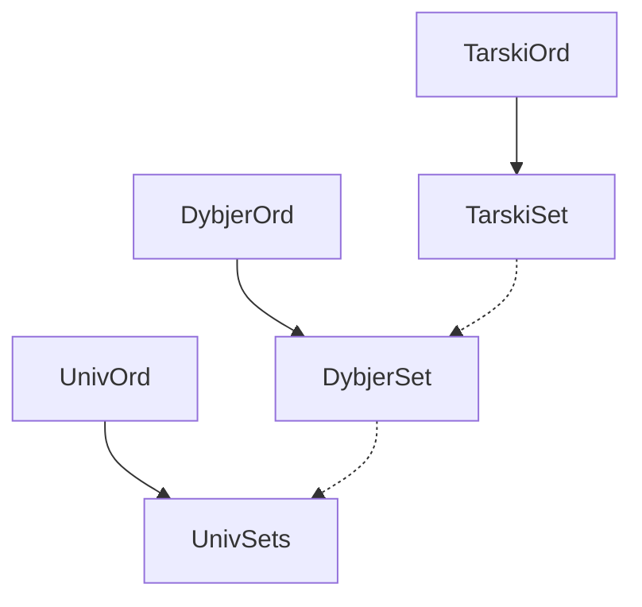

# Grafo de Dependencias (DEPENDENCIES)

Estructura macro de dependencias entre módulos en el repositorio.

- Las implementaciones `Set` siempre dependen de su respectiva contraparte `Ord`.
- `UnivSets` y `DybjerSet` interactúan entre sí vía inmersiones.
